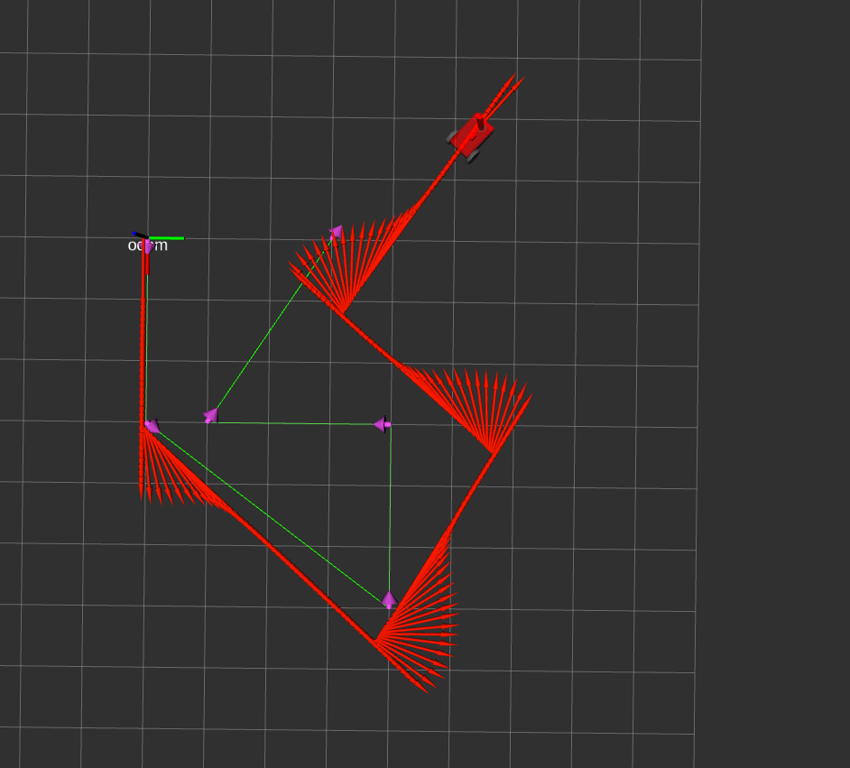

# Homework 2

In this assignment we implement simple path tracking strategy.
It accepts a list of waypoints and performs tracking of the each segment consequently.

## How to run:

```bash
ros2 run s23_mobile_robotics hw2
```

In `rviz` directory you may find configuration file for `rviz` to visualize the robot with both target and current trajectory.

## Observations:

Feedforward control is not enough to properly track the trajectory.
The most obvious problem is turning. We integrate angular velocity and it may result in some errors where robot misses his actual angle.

Examples with different trajectories and results:




## Algorithm

Probably there is no need to explain the algorithm itself, because it was given within assignment description.

The most important part is to calculate derivation of linear and angular velocities.

