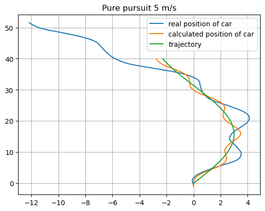

# Homework 3 - Lev Kozlov

## Formulation of pure pursuit and stanley controller

Despite car model having ackermann steering model I decided to use bicycle model to simplify kinematic calculation.

### Pure pursuit:

- Formulation is very similar to one we have from lectures, I changed only calculation of look ahead distance.

- $ l_d = k \cdot (v + 10^{-5} + L) $ where $L$ is distance between steering and back axles and $k$ is controller coefficient.

- $\delta = \frac{2 \cdot L \cdot \sin{\alpha}}{l_d}$ is steering angle for car

### Stanley control:

- For this controller I changed idea of finding cross-track error. As we do not control which points from path we select (it does planner from HW2), for me cross-track error is perpendicular distance for ray of current segment. Thus closest point on the path can exceed current segment and smooth following.

- $e_{\delta} = atan2(k \cdot d, k_p * v + 0.01)$ where d - distance to closest point on path and $k$, $k_p$ are coefficient of controller.

## Definition of error metric

I decided to compute several metrics based on sum of euclidian distance to path.

$$e = \frac{\sum{|| q - p ||}}{N}$$

where $q$ is current position and $p$ is closest point on path and $N$ is # of measurements to normalize error.

Also I computed this metric for `real` and `estimated` position of car. Later in plots you will see that with increase in target velocity car loses its real position faster.

- Error between path and estimated position:

  |                    | 0.5 m/s            | 5 m/s              |
  | ------------------ | ------------------ | ------------------ |
  | Pure pursuit       | 0.1899546265139448 | 0.3262951877243699 |
  | Stanley controller | 0.1551801044804019 | 0.3727621170851541 |

- Error between path and real position:

  |                    | 0.5 m/s           | 5 m/s             |
  | ------------------ | ----------------- | ----------------- |
  | Pure pursuit       | 2.510364249415953 | 6.207359952894094 |
  | Stanley controller | 2.361687266319950 | 13.10193044745825 |

## Plots with comparisons:

### Pure pursuit simulations:

<!--  -->

<!--  -->

### Stanley controller simulations:

<!--  -->

<!--  -->

## Conclusion and observations:

Errors in position estimation has huge effect on controllers performance.

They are produced not only during assumption about bicycle-like kinematic model. Steering has some oscillations when new steering is applied.

I made some experiments with feedback where I directly use state from odometry and it improved results. You can see how it would be in orange lines, they show where robot thinks it is.

It was strange that car oriented towards y-axis had frame angle 0. I had to rotate it manually in control program.

We can see that overall Stanley controller is smoother than Pure pursuit on such trajectories. It happens because Stanley controller uses both heading error and cross-track error. Drawback can appear on cornered trajectories, pure pursuit will follow trajectory more strictly.
