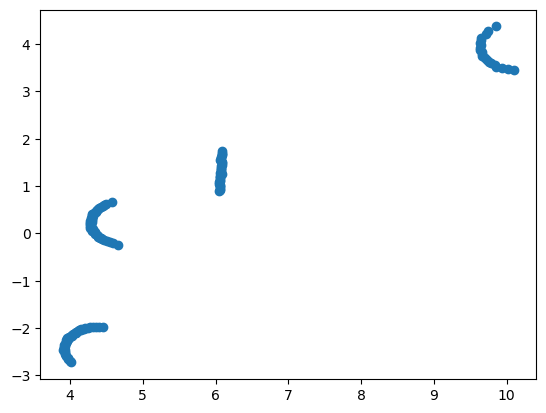
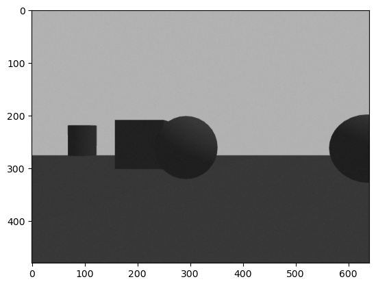
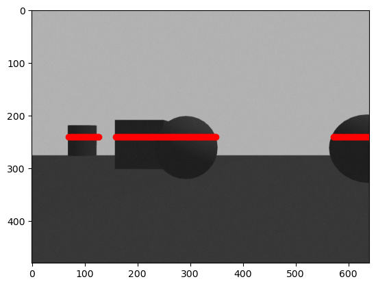

# Homework 4 - Lev Kozlov

The main part of this homework was to project lidar rays onto image from camera and show how it changes over time as we follow path.

1. I used `/depth_camera/camera_info` topic to get camera projection matrix.

2. Recorded static image and laser scan to develop algorithm.

## Algorithm:

### Transformation of point to image plane:

Given point in 3D $[X Y Z]$ we can transform it to image plane:

$$\begin{bmatrix}u \\ v \\ w\end{bmatrix} = P \cdot \begin{bmatrix}X \\ Y \\ Z \\ 1\end{bmatrix}$$

And coordinates of pixel would be $(\frac{u}{w}, \frac{v}{w})$

### Transformation of laser scan to 3d points:

For each laser scan range which is less than infinity resulting point will be:

$$\begin{bmatrix}X \\ Y \\ Z\end{bmatrix} = \begin{bmatrix} \cos{\theta} \cdot R \\ \sin{\theta} \cdot R \\ 0 \end{bmatrix}$$

Meaning that each point will be represented in camera frame, not world.



### Issues

When I implemented this algorithm I encountered some problems that result was not as expected. And it was caused by alignment of frames. In usual convension coordinate for depth in camera frame is Z, but in RVIZ we can see that it is X.

I read some articles and found this solution [here](https://github.com/jmount1992/understanding_ros_3d_point_to_image_projection)

```
x in the body frame = z in the optical frame
y in the body frame = -x in the optical frame
z in the body frame = -y in the optical frame
```

## Implementation and tests





After I did this on static image in this jupyter [notebook](homework4_vis.ipynb) it was not hard to add this to actual running script.

Overall performance was bad because it took much time for python to compute all transformations.

Video with demo can be found [here](https://youtu.be/TK-s-2n6uYE)
